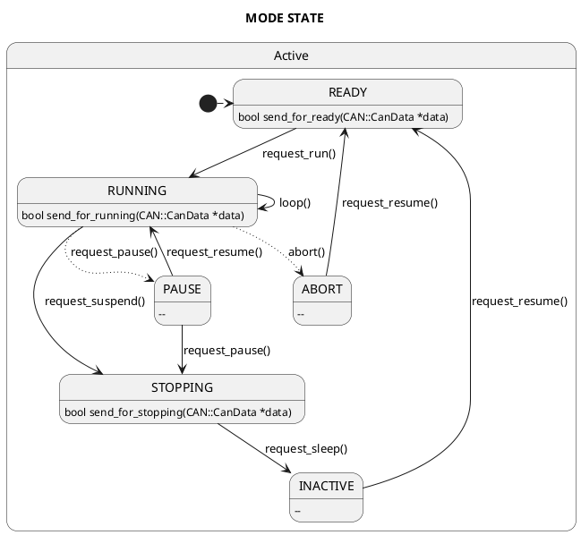
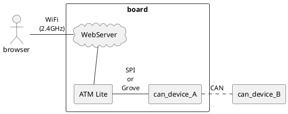

# CAN Data Viewer for ATOM Lite

<link href='https://raw.githubusercontent.com/MaSiRo-Project-OSS/CAN-Data-Viewer/master/doc/style.css' rel='stylesheet' type='text/css' media='all'>

This system uses a browser to view CAN data. This requires ATOM Lite and a CAN-BUS unit.

## Project Status

    

    This project will not be refurbished unless requested.

## Description

This system was made for viewing CAN data from a browser.
When developing devices that use CAN, such as AGVs (Automated Guided Vehicles), I wanted to see the data flowing on the CAN bus without using wired cables.
So I made a system using his Wifi function of ATOM Lite and his CANBus Unit.

The following features are provided so that the target unit can be operated in addition to viewing data.

* A function that acquires CAN data flowing on the CAN bus at 1-second intervals
* Ability to send CAN data only once
* Function to continue to flow specific CAN data
* Function to send specific CAN data at mode transition (requires source code modification)

### parts list

| No.  |             | Device type.    | Device                                             |
| ---- | ----------- | --------------- | -------------------------------------------------- |
| 1.   | Required    | Board           | ATM Lite                                           |
| 2-A. | need either | CAN             | MCP2515 CAN Bus Module TJA1050 Receiver SPI Module |
| 2-B. | ^           | ^               | CANBus Unit(CA-IS3050G)                            |
| 3.   | Option      | WiFi LAN router | Any router with 2.4GHz                             |

### System  diagram

## Usage

This system is described [here](./doc/README.md).

## Requirement

This system uses the following libraries.

* [m5stack/M5Atom](https://github.com/m5stack/M5Atom?utm_source=platformio&utm_medium=piohome)
* [fastled/FastLED](https://github.com/Makuna/NeoPixelBus?utm_source=platformio&utm_medium=piohome)
* [coryjfowler/MCP_CAN_lib](https://github.com/coryjfowler/MCP_CAN_lib?utm_source=platformio&utm_medium=piohome)
* [miwagner/ESP32CAN](https://github.com/miwagner/ESP32-Arduino-CAN?utm_source=platformio&utm_medium=piohome)

## Badges

* It have NOT tested the ESP32CAN library.
* It have NOT tested Extended CAN. Testing this feature depends on the CAN bus unit.

## Installation

This system is compiled using PlatformIO.Please install the extension from VS Code's extension recommendations. If you want to know more, check [here](https://docs.platformio.org/en/latest/).

## Support

Please use the [discussions channel](https://github.com/MaSiRo-Project-OSS/CAN-Data-Viewer/discussions).

## Roadmap

Update irregularly.

    

    Next Update&nbsp;:&nbsp; 
    No plans.

## Contributing

Pull requests are welcome. For major changes, please open an issue first
to discuss what you would like to change.

Please make sure to update tests as appropriate.

## Authors and acknowledgment

Show your appreciation to those who have contributed to the project.

## License

[MIT License](./LICENSE)
