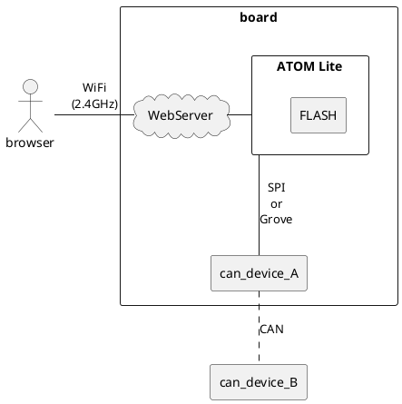
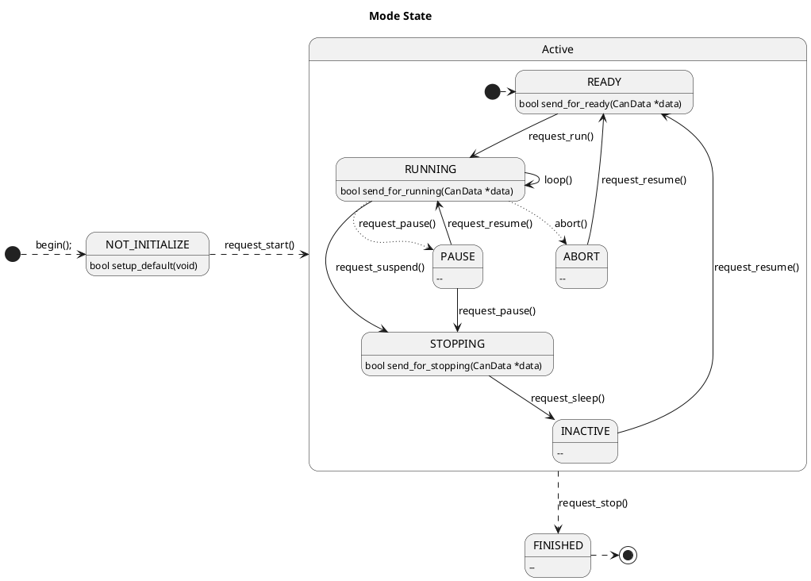

## System Diagram

<link href='https://raw.githubusercontent.com/MaSiRoProjectOSS/CANDataViewer/master/doc/style.css' rel='stylesheet' type='text/css' media='all'>

## Overall view

The system is shown below.

## Mode State

The mode changes as follows.

