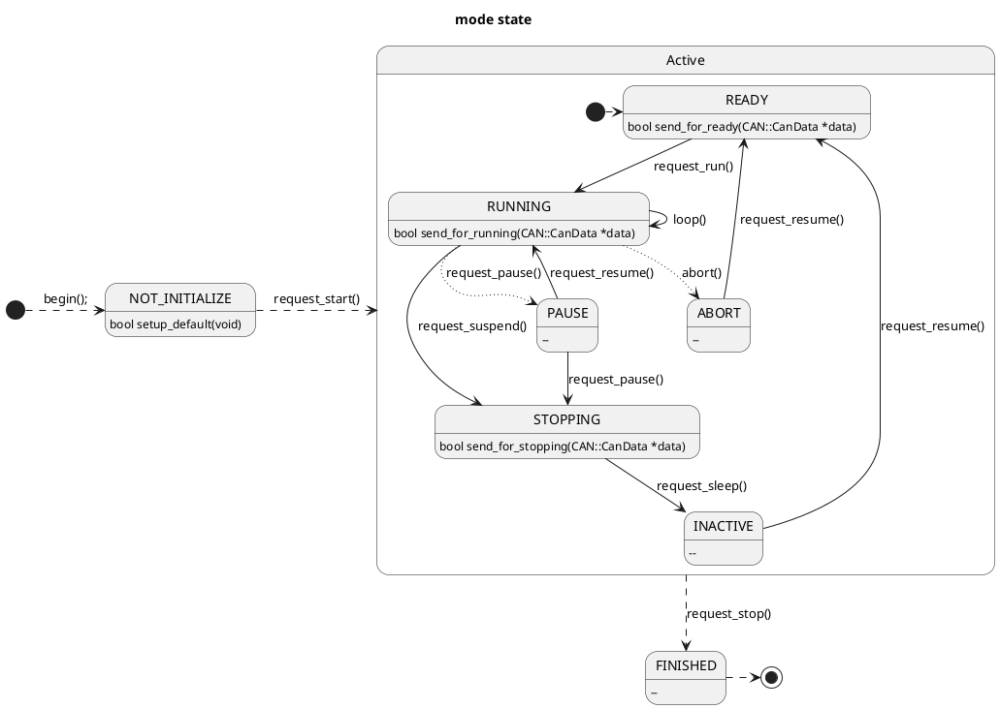

## System Diagram

<link href='https://raw.githubusercontent.com/MaSiRo-Project-OSS/CAN-Data-Viewer/master/doc/style.css' rel='stylesheet' type='text/css' media='all'>

## mode state

```plantuml
@startuml
title "mode state"

NOT_INITIALIZE : bool setup_default(void)
FINISHED : --
state Active {
  READY : bool send_for_ready(CAN::CanData *data)
  RUNNING : bool send_for_running(CAN::CanData *data)
  STOPPING : bool send_for_stopping(CAN::CanData *data)
  INACTIVE : --
  ABORT : --
  PAUSE : --
[*] -[dashed]right-> READY
}

[*] -[dashed]right-> NOT_INITIALIZE : begin();

NOT_INITIALIZE -[dashed]right-> Active : request_start()
READY --> RUNNING : request_run()
RUNNING -[dotted]-> ABORT : abort()
INACTIVE --> READY : request_resume()
ABORT --> READY : request_resume()

RUNNING --> STOPPING : request_suspend()
STOPPING --> INACTIVE : request_sleep()
RUNNING --> RUNNING : loop()
RUNNING -[dotted]-> PAUSE : request_pause()
PAUSE --> RUNNING : request_resume()
PAUSE --> STOPPING : request_pause()


Active -[dashed]-> FINISHED : request_stop()
FINISHED -[dashed]right-> [*]

@enduml
```
